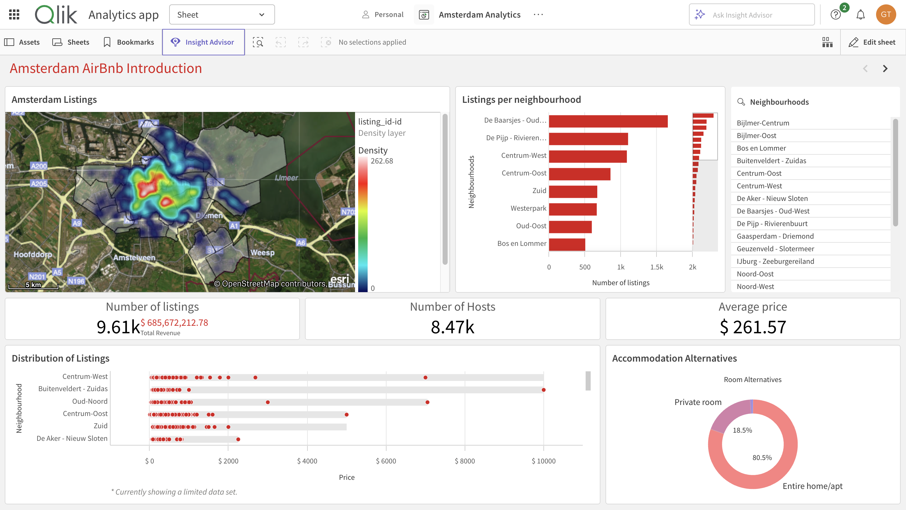
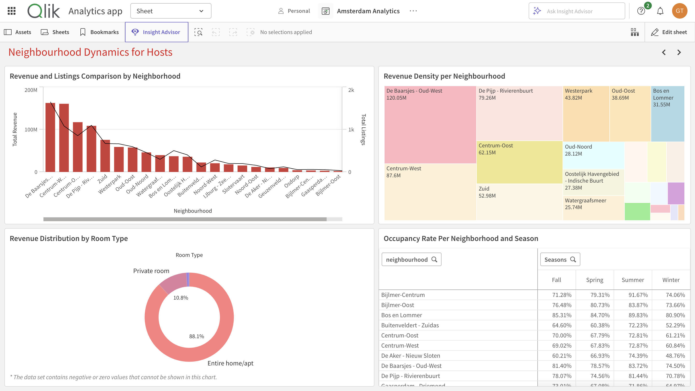
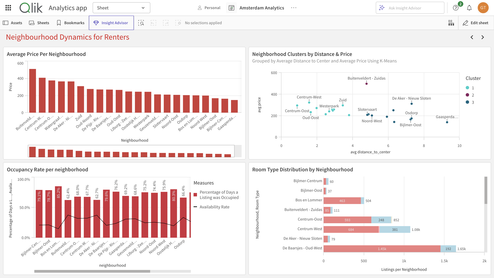
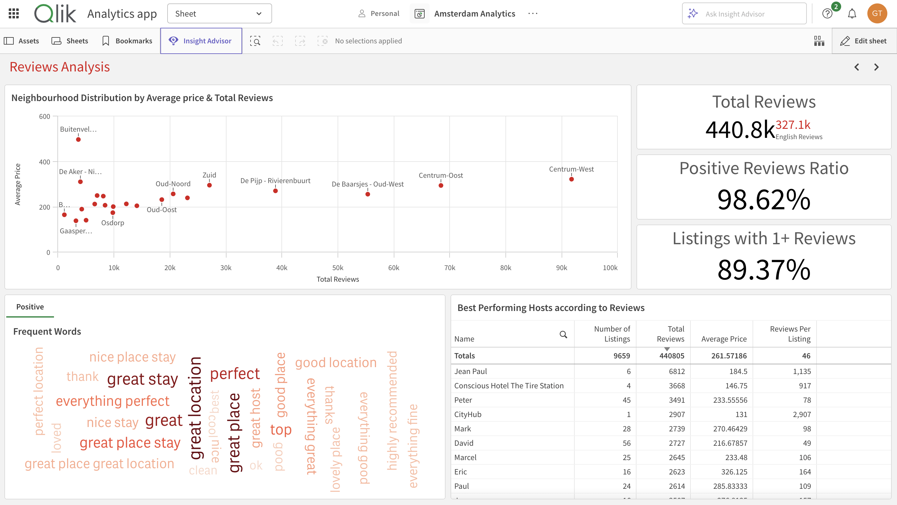
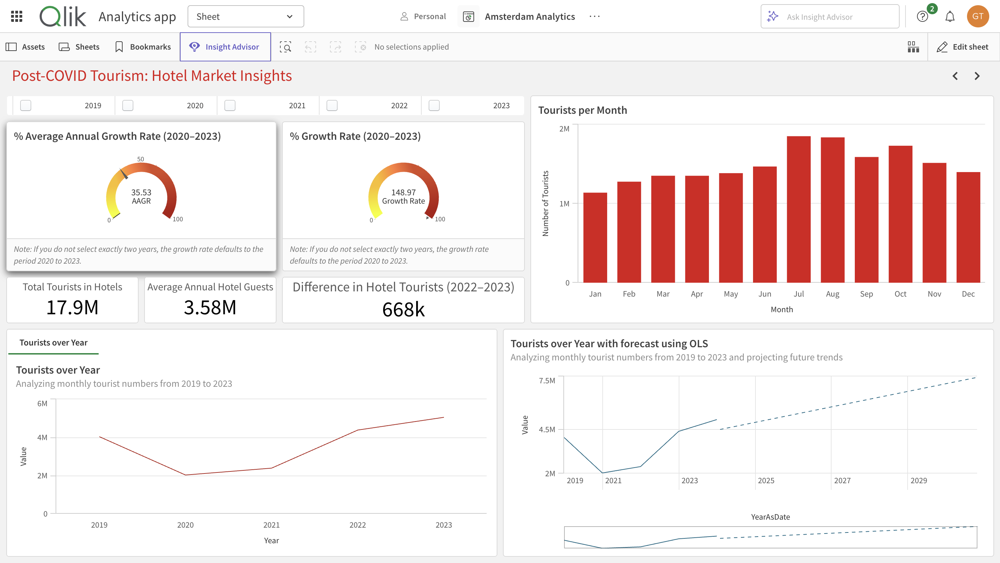

# BI-Amsterdam-Airbnb-Analysis

An analytical project exploring Airbnb listings in Amsterdam using data from Inside Airbnb, Statista, and other sources. This repository focuses on the preprocessing steps required to prepare the datasets for integration into a business intelligence (BI) application for further analysis.

## Table of Contents
1. [Project Overview](#project-overview)
2. [Contents of the Repository](#contents-of-the-repository)
3. [Preprocessing](#preprocessing)
4. [How to Use](#how-to-use)
5. [Qlik Dashboard Analysis & Insights](#qlik-dashboard-analysis--insights)
   - [Airbnb Listings in Amsterdam](#Airbnb-Listings-in-Amsterdam)
   - [Neighbourhood Dynamics for Hosts](#neighbourhood-dynamics-for-hosts)
   - [Reviews Analysis](#reviews-analysis)
   - [Neighbourhood Dynamics for Renters](#neighbourhood-dynamics-for-renters)
   - [Tourism & Hotel Market Insights](#Tourism-&-Hotel-Market-Insights)
6. [Conclusion](#Conclusion)
7. [Limitations and Challenges](#Limitations-and-Challenges)
8. [License](#license)
9. [Project Context](#Project-Context)

---

## Project Overview
This project involves preprocessing raw datasets to clean, structure, and enhance them for analysis. The processed files can be used in BI tools like Qlik Sense to analyze Airbnb pricing, availability, reviews, and tourism trends, as well as compare Airbnb performance with Amsterdam’s hotel market.

## Contents of the Repository
- `datasets/`: Contains the raw datasets required for preprocessing. Refer to the `datasets/README.md` for details about the files.
- `BI-PreProccessingDatasetFINAL.ipynb`: Jupyter Notebook with the full preprocessing pipeline.
- `BI-Amsterdam-Analysis.pdf`: A comprehensive document containing the preprocessing code, results, and insights for users unable to run the code.
- `screenshots/`: Folder containing screenshots of the Qlik dashboard analysis.
- `README.md`: Overview of the preprocessing steps and repository structure.

## Preprocessing
The preprocessing pipeline was implemented in Python using libraries such as `pandas`, `numpy`, and `NLTK`. It focuses on preparing the datasets for seamless integration into BI tools.

### Key Preprocessing Steps:
- **Data Cleaning**: Addressed missing values, removed duplicates, and standardized formats.
- **Feature Engineering**: Created new variables, such as `distance_to_center`, to enhance analytical value.
- **Sentiment Analysis**: Performed sentiment analysis on guest reviews using the VADER lexicon, with filtering for English comments.
- **Reshaping Tourism Data**: Cleaned and reshaped hotel tourism data from Statista into a format suitable for temporal analysis.
- **Outlier Detection and Removal**: Identified and handled outliers in pricing and other numeric fields.

The complete code for these steps is provided in the `BI-PreProccessingDatasetFINAL.ipynb` notebook.

## How to Use
1. Clone this repository:  
   ```bash
   git clone https://github.com/georgeTs19/BI-Amsterdam-Airbnb-Analysis.git
   ```
2. Download the reviews.csv.gz dataset from the Inside Airbnb website and place it in the datasets folder.
3. Open the BI-PreProccessingDatasetFINAL.ipynb notebook and run the code to preprocess the datasets.
4. Use the processed files in a BI application of your choice for further analysis.


## Qlik Dashboard Analysis & Insights  
This section includes key insights obtained from the Qlik dashboard, categorized into different sheets.  

### Airbnb Listings in Amsterdam  
  
**Insights:**  
- The total number of Airbnb listings in Amsterdam is **9.61k**, hosted by **8.47k** unique hosts, indicating a mix of single and multiple-property hosts.  
- The **average listing price is $261.57**, with some listings exceeding **$10,000 per night**, likely representing luxury accommodations.  
- Entire homes/apartments make up **80.5%** of all listings, while private rooms account for **18.5%**, showing a strong preference for full-home rentals.  
- The total revenue generated by Airbnb listings in Amsterdam surpasses **$685M**, with the highest earnings concentrated in central neighborhoods.  

### Neighbourhood Dynamics for Hosts  
  
**Insights:**  
- **Revenue Distribution**: The highest revenue is concentrated in central neighbourhoods like **De Baarsjes - Oud-West, Centrum-West, and De Pijp - Rivierenbuurt**, indicating these areas are Airbnb hotspots.  
- **Room Type Preference**: Entire homes/apartments dominate the revenue stream, making up **88.1%** of total revenue, while private rooms contribute only **10.8%**.  
- **Occupancy Rate Trends**: Certain neighbourhoods like **Bijlmer-Centrum and Bijlmer-Oost** have occupancy rates above **70%** across all seasons, suggesting strong demand in these areas.

### Neighbourhood Dynamics for Renters  
  
**Insights:**  
- **Price Variation Across Neighbourhoods**: The highest prices are found in **Buitenveldert - Zuidas, Centrum-West, and Centrum-Oost**, with some listings exceeding **€500 per night**.  
- **Distance vs. Price Clusters**: Listings closer to the city center tend to have higher prices, while neighbourhoods further from the center exhibit more competitive pricing.  
- **Occupancy Rates**: **Bijlmer-Centrum, Bos en Lommer, and De Baarsjes - Oud-West** have the highest occupancy rates, suggesting they are preferred locations due to affordability or proximity to major attractions.  

### Reviews Analysis  
  
**Insights:**  
- **Total Reviews**: Over **440.8k reviews** have been recorded, with an overwhelming **98.62% positive feedback rate**.  
- **Best Performing Hosts**: Some hosts have exceptionally high review rates, with **CityHub averaging 2,907 reviews per listing**, indicating a strong and engaged customer base.  
- **Common Positive Feedback**: Guests frequently mention **great location, perfect stay, and highly recommended**, emphasizing the importance of location and hospitality quality.  


### Tourism & Hotel Market Insights  
  
**Insights:**  
- The tourism industry saw a **148.97% growth rate** in hotel stays between **2020-2023**, reflecting a strong post-COVID recovery.  
- Amsterdam records an annual average of **3.58M hotel guests**, with **17.9M total tourists staying in hotels**.  
- The peak tourist season is **July and August**, with visitor numbers reaching their highest levels.  
- **OLS forecasting** predicts continued growth in tourist numbers beyond **2025**, potentially returning to **pre-pandemic levels**.

### Conclusion  

- **Prime Hotspots in Central Amsterdam**: Central areas like **De Baarsjes - Oud-West** and **Centrum-West** lead in revenue and occupancy, attracting high demand from both hosts and renters.  
- **Preference for Entire Homes**: There is a strong trend towards renting entire homes/apartments, with guests prioritizing privacy and space over private rooms.  
- **Positive Guest Experiences Drive Success**: Location and high-quality hospitality play a key role in generating positive reviews and repeat bookings.  
- **High Occupancy in Affordable Areas**: Neighbourhoods like **Bijlmer-Centrum** benefit from competitive pricing, making them attractive options for renters.  
- **Post-COVID Growth in Tourism**: Amsterdam's tourism sector has rebounded, with hotel stays growing by **148.97%** between **2020-2023**.  
- **Continued Growth Projections**: Projections indicate sustained growth in both Airbnb and the hotel markets, with tourism expected to surpass the pre-pandemic levels beyond **2025**.  

### Limitations and Challenges  

While the Qlik dashboard analysis provides valuable insights, there are several limitations and challenges that should be considered:

1. **Data Completeness and Accuracy**:
   - The accuracy of the insights depends on the completeness and reliability of the data. Missing or outdated listings, as well as incomplete information on properties or host performance, could skew the results.
   - Certain listings that may no longer be active could still be included in the data, potentially leading to overestimations in metrics like total revenue or occupancy rates.

2. **Temporal Analysis Limitations**:
   - The data does not account for seasonal variations or changes over time beyond the immediate analysis period, limiting the ability to predict future trends in Airbnb listings or rentals accurately.
   - While the tourism growth rate shows a post-COVID recovery, it does not account for potential disruptions, such as new regulatory changes or unforeseen events (e.g., pandemics, economic downturns), that could affect both tourism and the short-term rental market.

3. **Absence of Regulatory Data**:
   - Amsterdam, like many cities, has introduced or may introduce regulations to control short-term rentals. The dashboard does not account for the impact of these regulations (e.g., rental caps or licensing requirements), which could significantly influence the Airbnb market in the future.

4. **Potential Bias in Reviews**:
   - The high percentage of positive reviews (98.62%) might indicate a bias, as guests with negative experiences are less likely to leave reviews or may be underrepresented. This can give a skewed representation of guest satisfaction and performance for hosts, particularly in areas with a large volume of listings.

5. **Market Segmentation**:
   - While the analysis captures general trends, it does not delve into the specifics of market segmentation, such as guest demographics (e.g., business vs. leisure travelers), which could provide further insights into pricing behavior and listing preferences.

6. **Limited Comparison with Other Platforms**:
   - The analysis focuses solely on Airbnb listings, without considering other short-term rental platforms (e.g., Booking.com, Vrbo) that might also contribute significantly to Amsterdam’s accommodation market. This limits the scope of the findings to Airbnb-specific trends and does not provide a complete view of the broader rental market.

  
## License  
This project is licensed under the **MIT License**. Feel free to use and modify the code as needed.  

## Project Context  
This repository was created as part of a project for the **INFN45: Business Intelligence** course in the **Master’s Programme in Information Systems** at **Lund University**.  

